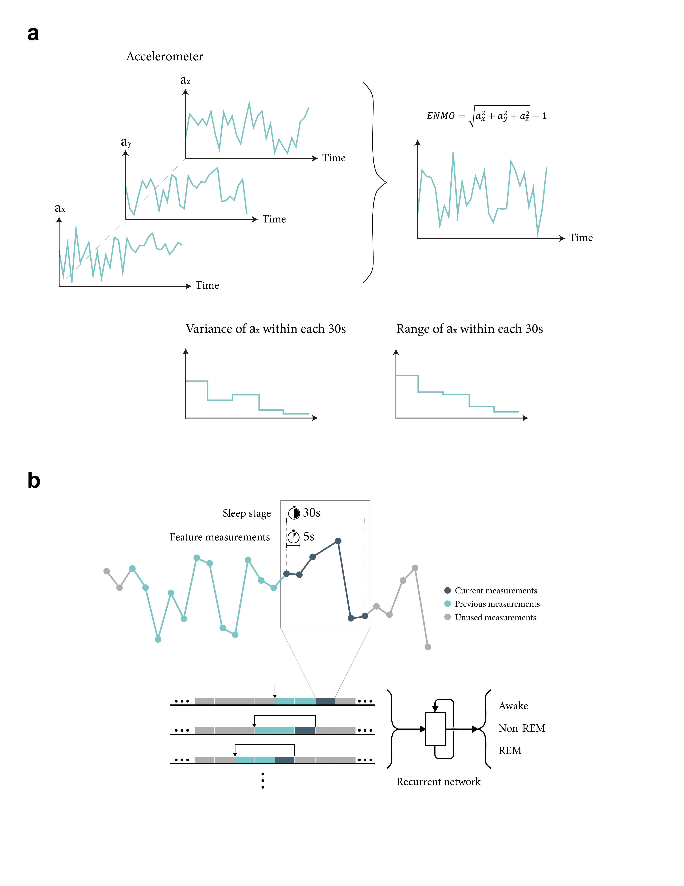

# Sleep stage classification based on Recurrent neural networks using wrist-worn device data
### Jian Hu, Haochang Shou*

Disturbances in sleep and anomaly movement are known to be closely related with various clinical endpoints. Traditionally, sleep detection and evaluations were mostly assessed via self-reported sleep diary or using polysomnography (PSG) in sleep clinics. With the increasing use of accelerometry tracking in many large-scale population studies such as the UK Biobank and National Health and Nutrition Examination Study (NHANES), multiple days of 24hr accelerometry data are often available from a large number of study subject. Hence it becomes a great interest for researchers to develop automatic algorithms that can reliably extract important features of sleep and circadian rhyme based on accelerometry tracking that are collected from subjects’ free-living conditions. 

Despite of the existing studies for sleep stage prediction using sensor data and advanced machine learning methods, most of them require input from multiple devices with several domains of biological signals and large number of participants in the training data, which poses challenges for collecting device data from in-home use. Our paper aims to asses whether sequential models(simple RNN and LSTM) can achieve a good performance in sleep stages classification with features extracted solely from wrist-worn accelerometers and limited training sizes. 

For thorough details, see the preprint: [Bioxiv]()
 

## Contributing
Souce code: [Github](https://github.com/jianhuupenn/Sleep-stage-classification)  
Author email: jianhu@pennmedicine.upenn.edu
 
We are continuing adding new features. Bug reports or feature requests are welcome.
 

## Debugging

## Reference

Please consider citing the following reference:
