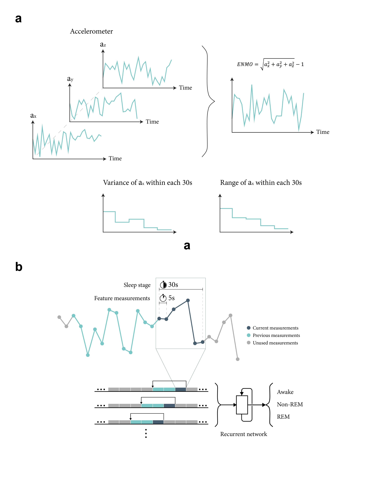

# Sleep stage classification based on Recurrent neural networks using wrist-worn device data
### Jian Hu, Haochang Shou*

For thorough details, see the preprint: [Bioxiv]()
 

## Contributing
Souce code: [Github](https://github.com/jianhuupenn/Sleep-stage-classification)  
Author email: jianhu@pennmedicine.upenn.edu
 
We are continuing adding new features. Bug reports or feature requests are welcome.
 

## Debugging

## Reference

Please consider citing the following reference:
